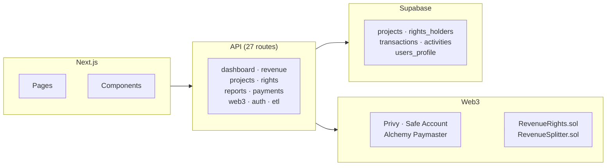

# LUNIM

**Web3 creative rights management and automated revenue distribution platform.**

Cinematic-grade royalty splitting backed by smart contracts on Base Sepolia. Real-time milestone tracking, USD-denominated distributions, and pull-payment claiming.

<p align="center">
  <a href="https://web3-freedom-upgrade.vercel.app" target="_blank">Live Demo</a> ·
  <a href="#quick-start">Quick Start</a> ·
  <a href="#architecture">Architecture</a> ·
  <a href="#smart-contracts">Contracts</a>
</p>

<p align="center">
  
  
  
  
  
</p>

---

## Architecture



## Quick Start

```bash
git clone https://github.com/Lunim-Corporate/web3-distribution.git
cd web3-distribution
cp .env.example .env.local
npm install
npm run demo:full   # compile → deploy demo contract → seed DB
npm run dev         # starts Hardhat node + Next.js dev server
```

Opens at **http://localhost:3000** with demo data pre-loaded. Enable **Demo Mode** in the navbar to bypass authentication.

## Tech Stack

| Layer | |
|-------|---|
| **Frontend** | Next.js 14 (App Router), React 18, Tailwind CSS, Framer Motion |
| **Auth** | Privy — email, social login, embedded wallets |
| **Web3** | Viem, Permissionless.js, Safe Smart Account, Alchemy Paymaster |
| **Database** | Supabase — PostgreSQL, Row Level Security |
| **Smart Contracts** | Solidity 0.8.20, Hardhat, OpenZeppelin |
| **Payments** | Stripe Checkout + Webhooks |
| **Hosting** | Vercel (frontend), Base Sepolia (contracts) |

## Smart Contracts

### RevenueRights.sol
Core distribution contract using the Pull Payment pattern:
- Constructor sets holders with wallet addresses, names, roles, and basis points (must sum to 10000)
- `distributeRevenue()` — splits incoming ETH proportionally across all holders
- `claim()` — holders withdraw their accumulated balance
- `getRightsHolders()` — returns all holders with allocations
- Security: ReentrancyGuard, owner-only functions, basis point validation

### RevenueSplitter.sol
Extended version with dynamic post-deployment share management — add, remove, and update holders.

### Tests
```bash
npx hardhat test    # 44 tests across 2 test files
```

## Available Scripts

| Command | |
|---------|---|
| `npm run dev` | Start Hardhat node + Next.js concurrently |
| `npm run compile` | Compile Solidity contracts |
| `npm run deploy:demo` | Deploy demo contract to Hardhat (7 holders) |
| `npm run deploy:live` | Deploy live contract (10 holders) |
| `npm run seed` | Seed Supabase with demo data |
| `npm run demo:full` | compile → deploy:demo → seed (all-in-one) |
| `npm run build` | Production build |
| `npm run lint` | ESLint (next/core-web-vitals) |
| `npx hardhat test` | Contract unit tests |

## Environment Variables

Copy `.env.example` → `.env.local`. Required for local dev:

| Variable | |
|----------|---|
| `NEXT_PUBLIC_SUPABASE_URL` | Supabase project URL |
| `NEXT_PUBLIC_SUPABASE_ANON_KEY` | Supabase anonymous key |
| `SUPABASE_SERVICE_ROLE_KEY` | Supabase service role key |

Web3 features require additional vars: `NEXT_PUBLIC_PRIVY_APP_ID`, `PRIVY_APP_SECRET`, `DEPLOYER_PRIVATE_KEY`, `NEXT_PUBLIC_CHAIN_ID`, `NEXT_PUBLIC_DEMO_CONTRACT_ADDRESS`, `NEXT_PUBLIC_LIVE_CONTRACT_ADDRESS`, and Alchemy/Stripe keys.

See `.env.example` for the complete list with descriptions.

## Deployment

**Frontend** — connect `web3-freedom-upgrade` branch in Vercel dashboard for automatic deploys on push.

**Contracts** — deploy to Base Sepolia:
```bash
npx hardhat run scripts/deploy-testnet.js --network baseSepolia
npx hardhat verify --network baseSepolia <CONTRACT_ADDRESS>
```

## Security

- **Rate limiting** — 4-tier sliding window (read, write, auth, sensitive)
- **Input validation** — Zod schemas on all write routes
- **Auth** — Privy + server-side role verification (`requireAuth` / `requireAdmin`)
- **Middleware** — protects `/dashboard/*` and `/admin/*`
- **Admin role** — server-side only, never trusted from client cookies
- **Security headers** — CSP, `frame-ancestors 'none'`, HSTS
- **No secrets in git** — all sensitive values in `.env.local` (gitignored)

## License

Proprietary — Lunim Corporation.
